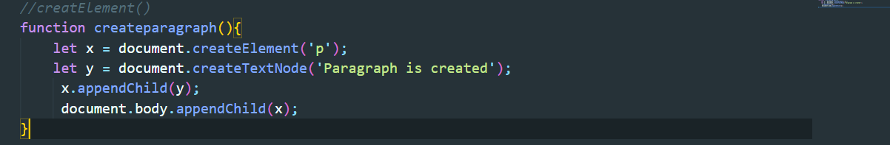

# DOM-Method-JavaScript

   
 ### createElement();
 
     The document.createElement() is used to dynamically create an HTML element node with the 
     
     specified name via JavaScript. This method takes the name of the element as the parameter 
     
     and creates that element node.
 
   ;

     Example:
 
   
 
     Output:

   ;
   
 ### appendchild()

     The JavaScript appendChild() is a method of the Node interface, used to append nodes 
     
     (typically elements) at the end of a specified parent node. It can be executed on existing 
     
     child nodes or by creating new elements: Appended' essentially means 'attach at the end'.
 
   

   
 
 ### classList()

     The JavaScript classList property consists of following methods through which we can 
     
     perform different operations on the class elements:

   

   
 ### setAtribute();

     The setAttribute() method is used to set an attribute on the specified element.

     If the attribute already exists on the element, the value is updated; otherwise a new 
     
     attribute is added with the specified name and value. The JavaScript code in the following 
     
     example will add a class and a disabled attribute to the <button> element.

   

     Similarly, you can use the setAttribute() method to update or change the value of an 
     
     existing attribute on an HTML element. The JavaScript code in the following example will 
     
     update the value of the existing href attribute of an anchor (<a>) element.

   ;

### removeAttribute()
   
     The removeAttribute() method is used to remove an attribute from the specified element.

     The JavaScript code in the following example will remove the href attribute from an anchor 
     
     element.

   ;